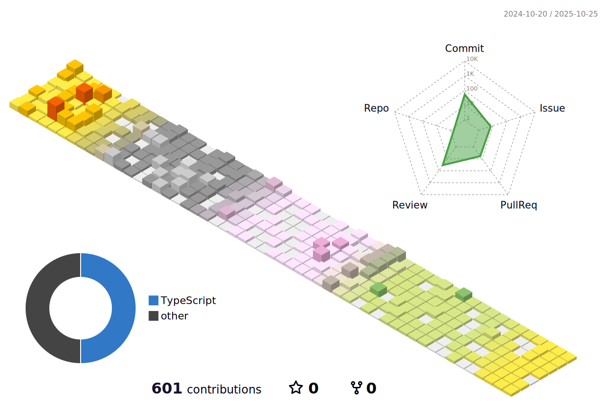

  <h3>Hello, I'm Amy</h3>
  
  <h4>🎓 I've Majored Industrial design, at SangMyung University</h4>

   
   
  
  

    
    
    
    
  

  

    
    
    
    
  

   
  <h5>📝 My Study Logs : <a href="https://velog.io/@55555-jyeon/posts">@55555-Jyeon</a></h5>
   

 
 

  <h3>My Experiences</h3>
  <h5>[2023.12 ~ 2024.02] : <a href="https://velog.io/@55555-jyeon/mobi-community" target="_blank">Mobi 2nd term</a></h5>
  <h5>[2023.05 ~ 2024.07] : project <a href="https://velog.io/@55555-jyeon/record-your-moments" target="_blank">YEOGI</a> with Mobi 3rd term</h5>
  <h5>[2023.08 ~ continue] : Mobi Community</h5>

 
 

  <h3> 📱 Contact Me</h3>
  <h5>jyeon380516@gmail.com</h5>

 
 

  
  

 
 

 
 

